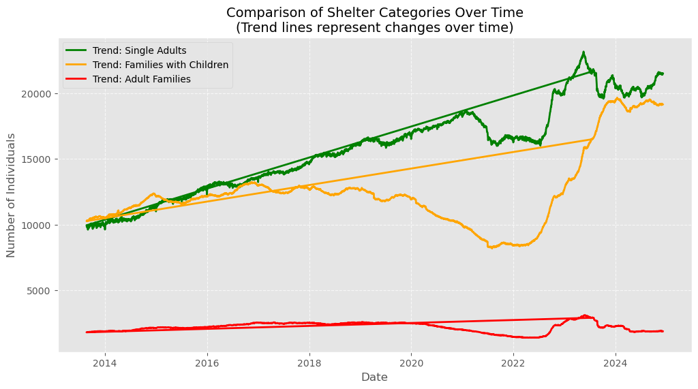
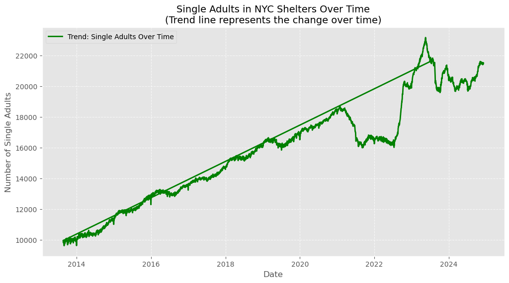
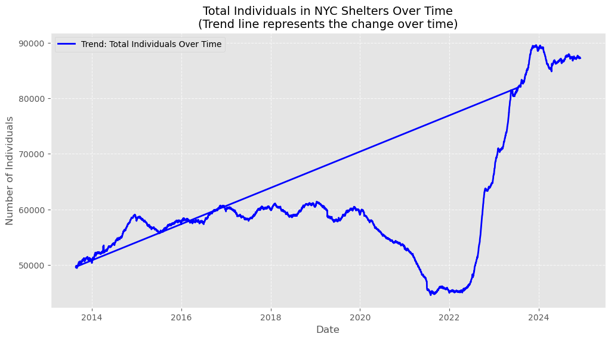
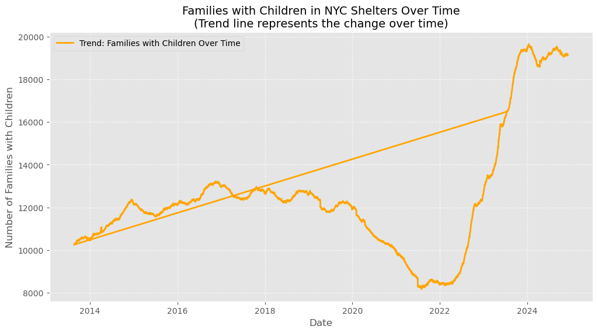
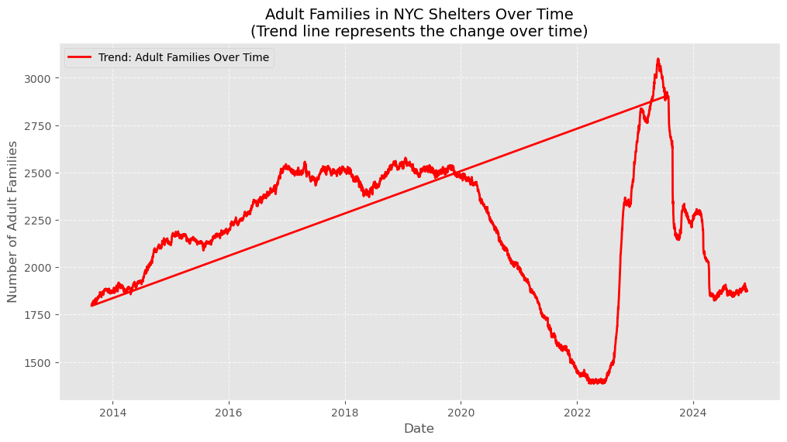

# Tracking NYC Homelessness

This project provides an in-depth analysis of NYC's homeless shelter data, focusing on uncovering trends, correlations, and actionable insights. The dataset captures daily counts of individuals in various population categories, such as single adults, families with children, and adult families, allowing us to understand the dynamics of homelessness in New York City.



---

## Table of Contents

- [Overview](#overview)
- [File Structure](#file-structure)
- [Getting Started](#getting-started)
- [Methodology](#methodology)
- [Visualizations](#visualizations)
- [Insights](#insights)
- [Future Directions](#future-directions)
- [Contributions](#contributions)
- [License](#license)
- [Acknowledgements](#acknowledgements)

---

## Overview

This project provides an in-depth analysis of NYC's homeless shelter data, focusing on uncovering trends, correlations, and actionable insights. The dataset captures daily counts of individuals in various population categories, such as single adults, families with children, and adult families, allowing us to understand the dynamics of homelessness in New York City.

### Purpose of the Analysis

The purpose of this analysis is to:
- Explore trends in homeless shelter populations over time.
- Compare population dynamics across various demographics.
- Generate actionable insights to support policymakers and stakeholders.
- Open the door to further predictive analytics, such as machine learning, for forecasting and optimization.


## Methodology

The analysis employs the following steps using the `data_helpers.py` module:

1. **Data Preprocessing**:
   - Standardized column names for consistency and ease of analysis.
   - Converted the `Date` column into `datetime` format for time-series operations.
   - Ensured missing values are identified for potential data cleaning.

2. **Exploratory Data Analysis (EDA)**:
   - Visualized trends for each category (e.g., total individuals, single adults, families with children).
   - Compared trends across multiple categories using overlayed time-series plots.
   - Examined correlation between shelter categories using a heatmap.

3. **Insights Extraction**:
   - Calculated statistical summaries, including averages, ranges, and peaks.
   - Identified the most and least populated days for shelters.

### Room for Improvement

This project sets the foundation for further improvements, including:
- **Anomaly Detection**:
  - Identify sudden surges or drops in shelter populations.
- **Forecasting**:
  - Use machine learning models (e.g., ARIMA, LSTM) to predict future trends.
- **Demographic Analysis**:
  - Incorporate additional demographic data to explore deeper insights.
- **Policy Impact**:
  - Assess the impact of specific policies or events on shelter populations.


## Visualizations

### Trends Over Time

1. **Single Adults in Shelters Over Time**  
   

2. **Total Individuals in Shelters Over Time**  
   

3. **Families with Children in Shelters Over Time**  
   

4. **Adult Families in Shelters Over Time**  
   

5. **Comparison of Shelter Categories Over Time**  
   

### Correlation Analysis
- A heatmap displays the relationships between population categories.
- Insights from correlation analysis can inform policy interventions targeting specific groups.


## Getting Started

### Requirements
Ensure the following are installed:
- Python 3.x
- Libraries: pandas, matplotlib, seaborn

### Steps to Run
1. **Clone the Repository**:
   ```bash
   git clone https://github.com/yourusername/TRACKING-NYC-HOMELESSNESS.git

2. **Navigate to the Project Directory:**
  ```bash
cd TRACKING-NYC-HOMELESSNESS
```

3. **Install Dependencies:**
  ```bash
pip install -r requirements.txt
```

4. **Place the Dataset:**

- Ensure DHS_Homeless_Shelter_Census.csv is in the project root directory.

5. **Run the Main Script:**

```python main.py
```

6. **Output:**
- Key insights will be printed to the console.
- Visualizations will be displayed for further analysis.

---

### Section 6: Insights
```markdown
## Insights

---


### Key Statistics
- **Time Period Covered**: `YYYY-MM-DD` to `YYYY-MM-DD`
- **Total Individuals Range**: `Min to Max`
- **Most Populated Shelter Day**: `YYYY-MM-DD` with `X` individuals
- **Least Populated Shelter Day**: `YYYY-MM-DD` with `Y` individuals

### Observations
1. **Single Adults**:
   - Consistent upward trend over the years.
   - Seasonal fluctuations observed during colder months.

2. **Families with Children**:
   - Significant growth during specific years.
   - Sharp declines observed, indicating possible interventions or reporting changes.

3. **Overall Correlation**:
   - Strong positive correlation between `Families with Children` and `Total Individuals`.

These insights highlight key population dynamics and suggest areas for targeted policy action.


## Future Directions

This project lays the groundwork for further analysis. Here are some potential next steps:

1. **Predictive Analytics**:
   - Develop machine learning models (e.g., ARIMA, LSTM) to forecast shelter usage.
   - Use regression models to predict the impact of external factors (e.g., weather, policy changes).

2. **Deep Demographic Analysis**:
   - Incorporate additional demographic data such as age, gender, and income levels.

3. **Policy Impact Studies**:
   - Analyze the effects of major events (e.g., new policies, economic downturns) on shelter populations.

4. **Interactive Dashboards**:
   - Build dashboards using tools like Tableau or Dash to make insights more accessible.

5. **Expand Geographic Scope**:
   - Include shelter data from other cities for comparative analysis.


## Contributions

Contributions are welcome! Feel free to:
- Fork this repository.
- Add new visualizations or analytical approaches.
- Submit a pull request with your improvements.

We encourage collaboration to make this project even more impactful.

---

## Source

- The introductory image and context are drawn from the following article:  
  **NY Times - NYC Homelessness and Policy**  
  [Link to Article](https://www.nytimes.com/2023/04/28/nyregion/homelessness-shelters-nyc.html)


## License

This project is licensed under the MIT License. See the [LICENSE](LICENSE) file for details.


## Acknowledgements

- NYC Department of Homeless Services for providing the dataset.
- Visualization tools used: Matplotlib, Seaborn.
- Inspiration for predictive analytics drawn from real-world policy challenges.


[Back to Top](#Table-of-Contents)